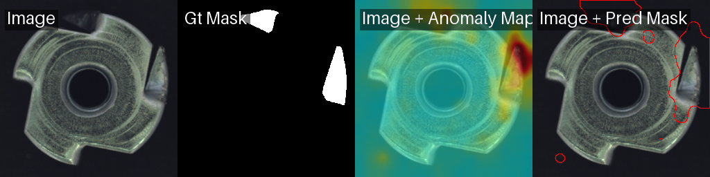
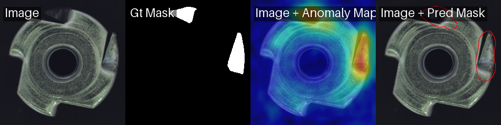
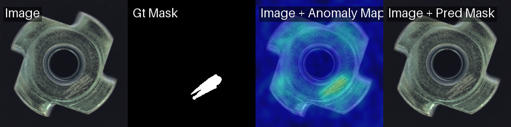
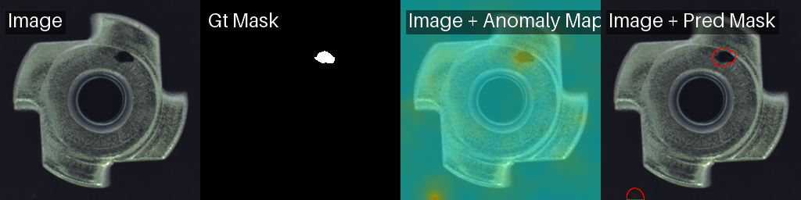
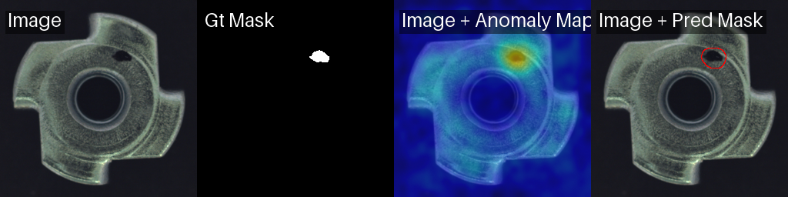
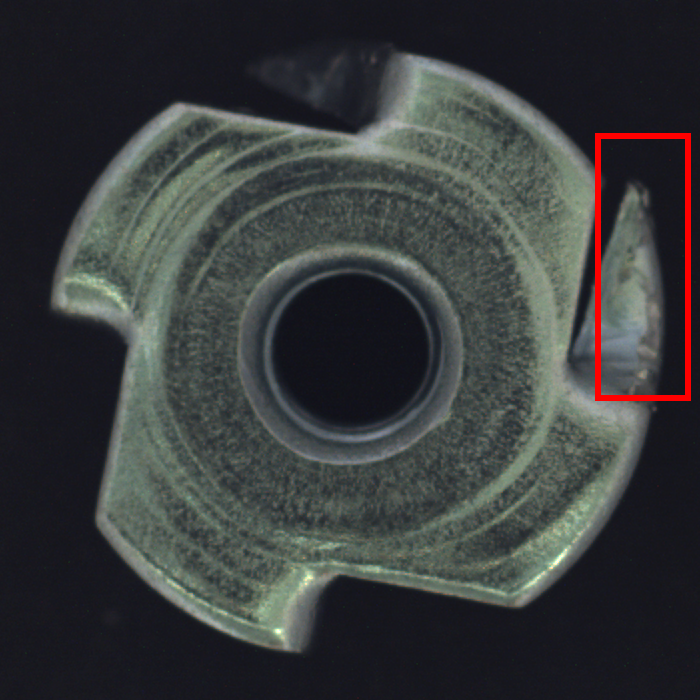

# Industrial Defect Inspection — 工业缺陷检测

基于 [Anomalib](https://github.com/openvinotoolkit/anomalib) 的**无监督**工业缺陷检测系统。
只用正常(good)样本训练,学习"正常分布",检测并定位偏离正常的缺陷区域 —— 贴合产线"缺陷样本稀少、形态多样、难以标注"的现实。

聚焦 **MVTec AD 的金属加工件类别(metal_nut 等)**,从机械制造视角解读缺陷特征。

> 状态:Week 1(baseline)+ Week 2(多模型对比选型)已完成,全程 **CPU**。

---

## 1. 问题与方法

- **范式**:无监督异常检测。训练集仅含 220 张正常金属螺母,模型学习正常特征分布;测试时凡偏离即判为异常,并输出像素级热力图定位缺陷。
- **为什么不用监督分类**:工业缺陷样本稀少且形态千变万化(毛刺、划痕、弯曲、色差…),标注覆盖不全;只学"正常"更鲁棒、更贴近产线。
- **评测指标**:Image AUROC(整图判别)、Pixel AUROC(像素级定位)、F1。工业上漏检代价 >> 误检,实际部署阈值偏向高 Recall。

## 2. 数据集

[MVTec AD](https://www.mvtec.com/company/research/datasets/mvtec-ad) — `metal_nut` 类别(金属螺母,真实机加工件):

| split | 数量 | 说明 |
|---|---|---|
| train/good | 220 | 仅正常样本 |
| test | 115 | good + 4 类缺陷:bent / color / flip / scratch |
| ground_truth | — | 像素级缺陷掩码 |

## 3. 结果

### 3.1 Baseline(Week 1)— PaDiM 缺陷定位

模型只看正常样本,即可在测试图上准确高亮缺陷区域。每张图四联:`原图 | 真实掩码 | 异常热力图 | 预测掩码`。

| 缺陷类型 | PaDiM | PatchCore |
|---|---|---|
| bent(弯曲) |  |  |
| scratch(划痕) |  |  |
| color(色差) |  |  |

> 全量 115 张热力图在 `results/`(本地生成,未入库)。

### 3.2 多模型对比(Week 2)— 工程取舍

同一品类、同一 CPU 下对比 PaDiM 与 PatchCore:

| 模型 | Image AUROC | Pixel AUROC | Image F1 | Pixel F1 | 拟合耗时 | 推理延迟/张¹ | 模型体积 |
|---|---|---|---|---|---|---|---|
| **PaDiM** | 0.937 | 0.946 | 0.930 | 0.665 | **35 s** | **169 ms** | 168 MB |
| **PatchCore** | **0.997** | **0.987** | **0.984** | **0.839** | 6200 s (~103 min) | 1422 ms | 227 MB |

¹ 端到端延迟,含预处理/后处理与热力图写盘 I/O(非纯前向推理)。

**选型结论:**
- **PatchCore = 精度天花板**:Image AUROC 0.997 近乎满分,但 CPU 上 coreset 内存库构建为 O(n²),拟合耗时 ~100 分钟、单张推理 1.4 s —— **不适合实时/边缘部署**。
- **PaDiM = 轻量实时**:拟合 35 s、推理 169 ms,精度低一档但工程上更可落地。
- **一句话**:精度优先且算力充足 → PatchCore;实时 / 边缘受限 → PaDiM(或后续 EfficientAD)。精度与算力的权衡取决于部署约束。

> EfficientAD 需要真正的梯度训练,CPU 上过慢,留待 GPU 环境补测(见 Roadmap)。

### 3.3 从机械视角解读缺陷(Week 3)

按缺陷类型拆解模型表现,用机械加工知识解释"为什么某些缺陷更难检":

| 缺陷类型 | 检出率 | 空间性质 | 机械解读 |
|---|---|---|---|
| flip(翻面) | 100% | 全局/整件 | 装夹朝向错误,整件偏离正常 → 最易检 |
| color(色差) | 64% | 局部 | 局部变色,看与底色对比度 |
| bent(弯曲) | 60% | 局部几何 | 局部塑性变形,看幅度/角度 |
| scratch(划痕) | 61% | 细小局部 | 低对比度细线痕,被大面积正常区稀释 → 最难检 |

**关键洞察**:高 Image AUROC(~0.93)掩盖了细小局部缺陷(scratch/bent)在固定阈值下约 40% 的漏检——评估要分类型看,小目标缺陷要靠 Pixel AUROC 与更强定位的模型(PatchCore Pixel AUROC 0.987)。

→ 完整分析:[docs/defect_analysis.md](docs/defect_analysis.md)

### 3.4 边缘部署(Week 4)— ONNX Runtime CPU 推理

把 PaDiM 导出为部署格式,端到端逐张推理(读图→预处理→推理→判定,batch=1,模拟产线单件):

| 后端 | 平均延迟 | 吞吐 | Image AUROC |
|---|---|---|---|
| PyTorch (CPU) | 189.4 ms | 5.3 FPS | 0.9482 |
| **ONNX Runtime (CPU)** | **132.9 ms** | **7.5 FPS** | 0.9482 |

- ONNX Runtime 相比 PyTorch **≈1.43× 加速**,且 **AUROC 完全一致(导出无精度损失)**。
- 实时 demo:单张缺陷图 → 「异常(NG)」,异常分 0.702,~72 ms。
- 验证导出正确性时踩了"双重预处理"坑(ONNX 图已内置 Resize+Normalize),靠**与参考实现逐位对齐分数**定位。
- OpenVINO 暂无 Python 3.13 Windows wheel,故用 ONNX Runtime(详见文档)。

→ 完整部署报告:[docs/deployment.md](docs/deployment.md)

### 3.5 VLM 诊断层(Week 5)— 检测 + 自然语言诊断

检测到缺陷后,把"整图 + 缺陷框 + 缺陷知识库"喂给 **Qwen2.5-VL(DashScope qwen-vl-max)**,输出缺陷类型 + 机械成因 + 处理建议:



> **bent 真实诊断**:1) 缺陷类型:bent(弯曲) 2) 成因:冲压成形受力不均/模具磨损导致边缘塑性变形 3) 建议:检查模具状态、优化压料力分布。

- **关键发现**:只喂紧裁剪时 bent 被误判为 color——几何类缺陷必须保留**整体轮廓上下文**;改喂整图+框后判断正确。说明 VLM 诊断质量高度依赖输入构造。
- **幻觉控制**:检测先行(已知有缺陷+定位)→ 知识库接地(RAG)→ 结构化输出 → 抽样人工核对。

→ 完整说明:[docs/vlm_diagnosis.md](docs/vlm_diagnosis.md)

## 4. 复现

```bash
# 环境 (Windows / Python 3.13)
pip install anomalib "pandas<3"          # 注意必须 pandas<3 (见踩坑记录)
pip install onnxruntime onnx             # W4 边缘部署用

# 数据: 放到 datasets/MVTecAD/metal_nut/  (anomalib 自带下载链接已失效, 用 HF 镜像)
#   huggingface: MSherbinii/mvtec-ad-metal-nut

set PYTHONUTF8=1                          # Windows 中文控制台必需

python scripts/run_padim.py              # W1 baseline
python scripts/run_compare.py            # W2 多模型对比 -> results/comparison.md
python scripts/run_defect_analysis.py    # W3 逐缺陷分析 -> results/defect_analysis.md

# W4 部署基准 (导出 + 推理): 需额外两个环境变量
#   TRUST_REMOTE_CODE=1  -> 允许加载自己导出的 .pt (pickle)
#   HF_HUB_OFFLINE=1     -> 用缓存 backbone, 避免网络抖动
set TRUST_REMOTE_CODE=1 && set HF_HUB_OFFLINE=1 && python scripts/run_deploy.py

# W5 VLM 诊断 (检测+定位+VLM): 需 DashScope key (未设则 mock 兜底)
pip install openai
set DASHSCOPE_API_KEY=sk-xxx && set TRUST_REMOTE_CODE=1 && python scripts/run_vlm_diagnosis.py [图片路径]
```

## 5. 踩坑记录(工程细节)

| 问题 | 原因 | 解决 |
|---|---|---|
| MVTec 自动下载 404 | anomalib 内置的 mydrive.ch 链接已失效 | 改用 Hugging Face 镜像,按标准目录结构放置后框架自动识别 |
| `num_samples=0` 训练为空 | **pandas 3.0** 改变了字符串枚举与 DataFrame 列的比较行为,anomalib 的 `Split` 过滤全空 | 降级 `pandas<3` |
| Windows `UnicodeEncodeError` | GBK 控制台无法渲染 rich 进度条的 `•` | `PYTHONUTF8=1` + `enable_progress_bar=False` |
| ONNX AUROC 退化到 0.5 | 导出的 ONNX 图已内置 Resize+Normalize,我又手动预处理 → **双重预处理**,分数全饱和 | 只喂原尺寸 `[0,1]` 图;靠与 TorchInferencer 分数逐位对齐定位 |
| 加载 `.pt` 被拒 / backbone 下载 10054 | pickle 安全限制;HF 网络抖动 | `TRUST_REMOTE_CODE=1`;`HF_HUB_OFFLINE=1` 用缓存 |

## 6. 局限与下一步(Roadmap)

- [x] **W1** baseline(PaDiM)
- [x] **W2** 多模型对比 + 选型(PaDiM vs PatchCore)
- [x] **W3** 从机械视角解读缺陷特征(逐类型检出分析 → [docs/defect_analysis.md](docs/defect_analysis.md))
- [x] **W4** 边缘部署:ONNX 导出 + CPU 推理基准(1.43× 加速,精度无损)→ [docs/deployment.md](docs/deployment.md)
- [x] **W5** VLM 诊断层:检测→定位→Qwen2.5-VL 输出类型/成因/建议 → [docs/vlm_diagnosis.md](docs/vlm_diagnosis.md)
- [x] **W6** 整合评测报告 → [docs/evaluation_report.md](docs/evaluation_report.md);demo 视频 + GPU 补测 EfficientAD 待补

**已知局限**:用的是公开数据,真实产线需做域适应微调;当前延迟含可视化 I/O,后续应单独测纯推理 FPS。
