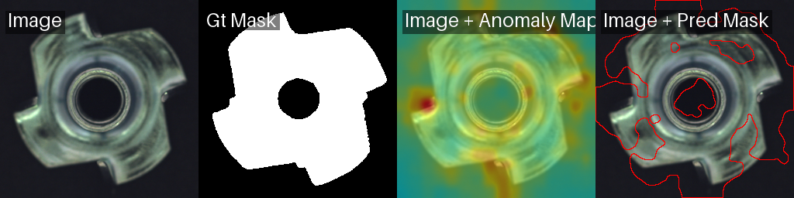
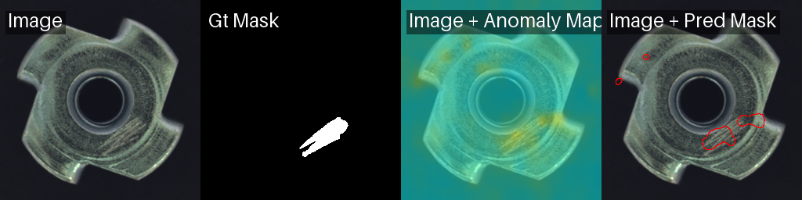

# Week 3 · 从机械视角解读金属件缺陷特征

> 数据:PaDiM 在 MVTec AD `metal_nut`(金属螺母)测试集上逐张打分。
> 图像级异常分阈值 = good 样本 `mean + 2·std = 0.589`。

## 逐缺陷类型检出表现

| 缺陷类型 | 样本数 | 平均异常分 | 最小 | 最大 | 检出率 | 缺陷的空间性质 |
|---|---|---|---|---|---|---|
| **flip**(翻面) | 23 | **0.827** | 0.697 | 0.985 | **100%** | 全局 / 整件 |
| color(色差/污染) | 22 | 0.686 | 0.459 | 1.000 | 64% | 局部 |
| bent(弯曲) | 25 | 0.687 | 0.447 | 1.000 | 60% | 局部几何 |
| scratch(划痕) | 23 | 0.674 | 0.460 | 1.000 | 61% | 细小局部 |
| good(正常) | 22 | 0.473 | 0.382 | 0.610 | 5%(误报) | — |

## 核心结论:缺陷的"空间尺度"决定检测难度

模型对缺陷的检出难度,和缺陷在零件上**占据的视觉面积/对比度**强相关——这正是可以用机械加工知识解释的地方:

### 1. flip(翻面)— 最易,100% 检出
螺母被**整体翻转/装反**,是装夹或上料环节的朝向错误。视觉上**整个零件**的纹理、螺纹孔形态都与正常面不同,属于**全局异常**。真实掩码几乎覆盖全件,模型轻松拉高异常分(均值 0.827,远离正常区)。

*flip:真实掩码覆盖整件,异常图全局响应。*

### 2. scratch(划痕)— 最难,61% 检出
划痕是加工/搬运中产生的**细小、低对比度的表面线痕**,只占零件极小面积。它对"整图异常分"的贡献被大面积正常区域稀释,因此分数低、与正常样本重叠(最小分 0.460,已落入 good 的 0.382–0.610 区间),约 39% 漏检。

*scratch:真实掩码仅底部一道细痕,异常图弥散、定位不准。*

### 3. bent(弯曲)/ color(色差)— 居中,60–64%
- **bent**:局部塑性变形,视觉偏离程度受**变形幅度和拍摄角度**影响,轻微弯曲不易察觉。
- **color**:局部变色/污染,可检性取决于**与金属底色的对比度**。

这两类介于"全局 flip"与"细小 scratch"之间,因此检出率居中。

## 工程含义(面试可讲)

1. **高 Image AUROC ≠ 各类缺陷都检得好。** 整体 Image AUROC ~0.93 看着漂亮,但按缺陷类型拆开,细小局部缺陷(scratch/bent)在固定阈值下漏检约 40%。**评估必须分类型看,不能只看一个总指标。**
2. **工业上漏检代价高 → 阈值应偏向高召回。** 当前阈值(mean+2std)偏保守,把阈值下调可提升 scratch/bent 召回(代价是 good 误报上升)——这是典型的**召回/误报权衡**,要按产线"漏检 vs 误检"的成本来定。
3. **小目标缺陷要靠像素级能力。** 图像级分数会稀释小缺陷;应看 **Pixel AUROC** 并选定位更强的模型——对照实验中 PatchCore 的 Pixel AUROC 达 **0.987**(PaDiM 0.946),正是为细小缺陷场景准备的。
4. **下一步**:针对 scratch 这类小目标,可做(a)更高分辨率输入、(b)patch 级评分、(c)按缺陷类型分别定阈值。

---
*生成脚本:[`scripts/run_defect_analysis.py`](../scripts/run_defect_analysis.py)。原始逐类数据:`results/defect_analysis.md`。*
