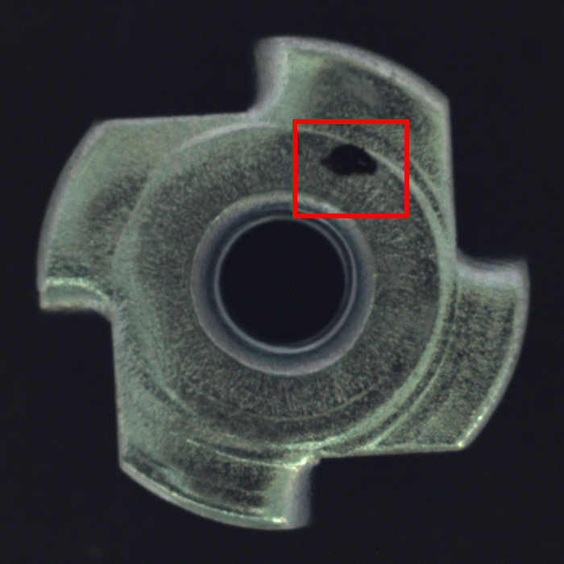
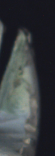

# Week 5 · VLM 诊断层(检测 → 定位 → 自然语言诊断)

在"检测到缺陷"之后加一层多模态大模型(VLM),对缺陷输出**类型 + 机械成因 + 处理建议**的自然语言诊断。把 CV 检测与 LLM 推理缝合,是项目的多模态亮点。

## 管线

```
输入图 → PaDiM(W4 导出的 TorchInferencer)打异常分 + 出热力图
       → 从热力图取 top-1% 峰值区, 定位缺陷 bbox
       → 整图 + 红框标注(保留整体几何, 又给出定位)
       → 拼接"缺陷知识库"(RAG) 作为领域参考
       → Qwen2.5-VL(DashScope qwen-vl-max)输出诊断
```

- **VLM**:Qwen2.5-VL,经 DashScope 的 OpenAI 兼容接口调用(`qwen-vl-max`)。
- **知识库(RAG 味道)**:把 bent/scratch/color/flip 四类缺陷的机械成因写入 system prompt 作为参考,让诊断**有依据而非凭空生成**——复用 RAG 的"检索领域知识给依据"思路。

## 真实诊断输出(qwen-vl-max)

**例 1 — bent(弯曲)**

> 1) 缺陷类型:bent(弯曲)
> 2) 可能成因:冲压成形时局部受力不均或模具磨损导致边缘塑性变形
> 3) 处理/改善建议:检查冲压模具状态,优化压料力分布,增加成形过程中的支撑稳定性

**例 2 — color(色差/污染)**

> 1) 缺陷类型:color(色差/污染)
> 2) 可能成因:局部油污残留或电镀不均导致表面氧化/附着物
> 3) 处理/改善建议:加强清洗工序,优化电镀工艺参数以确保均匀性

两例的类型判断均正确,成因与建议在机械工艺上合理。

## 关键工程发现:输入设计决定 VLM 诊断质量

最初我只把**紧裁剪的缺陷局部**喂给 VLM。结果 bent(弯曲)被误判为 **color(色差)**:


> (脱离整体轮廓的边缘裁剪)→ VLM 输出 "color(色差/污染)" ❌

原因:**bent / flip 这类几何缺陷必须看整体形状才能判断**,而紧裁剪丢掉了轮廓上下文,VLM 只能凭局部纹理猜成"色差/污染"。

改为喂**整图 + 红框标注**(既保留整体几何,又指明缺陷位置)后,同一张图被正确判为 **bent** ✅。

> 叙事点:这说明 VLM 诊断的质量**高度依赖输入构造**——局部缺陷(scratch)适合裁剪放大,几何缺陷(bent/flip)必须保留全局上下文。一个真正做过的人会强调这点。

## 如何控制 VLM 幻觉(面试高频问)

1. **检测先行,VLM 后置**:只对检测模型判定为异常的图做诊断,并给出异常分与定位框,VLM 在"已知有缺陷+在哪"的约束下推理,而非自由发挥。
2. **知识库接地(RAG)**:把缺陷类型与成因作为参考知识注入提示,要求"从知识库选最匹配的,不确定就说明",减少凭空编造。
3. **输入构造**:保留几何上下文(见上),避免因信息缺失而臆测。
4. **结构化、克制输出**:限定分点格式与篇幅。
5. **下一步**:对诊断做抽样人工核对,统计"类型判断准确率";接入工艺标准文档做检索增强,给出引用依据。

---
*生成脚本:[`scripts/run_vlm_diagnosis.py`](../scripts/run_vlm_diagnosis.py)。需 `DASHSCOPE_API_KEY`;未设 key 时用 mock 兜底,流程照样跑通。*
